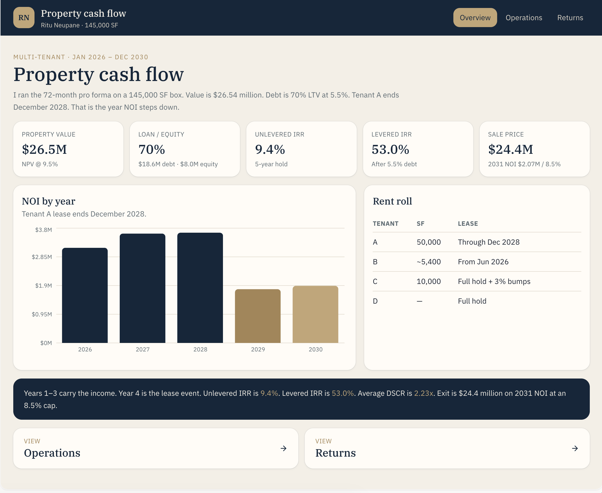
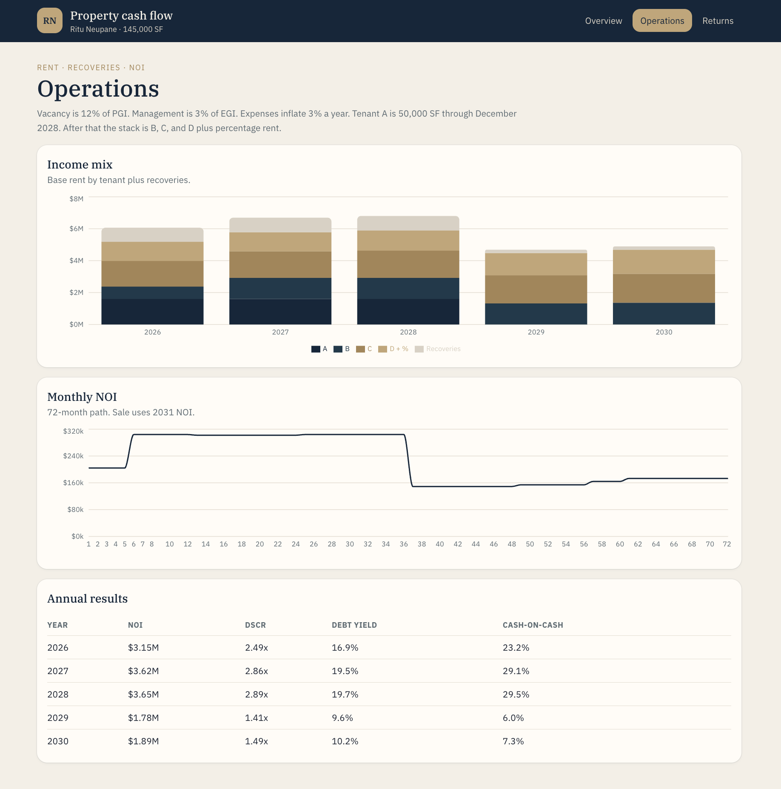
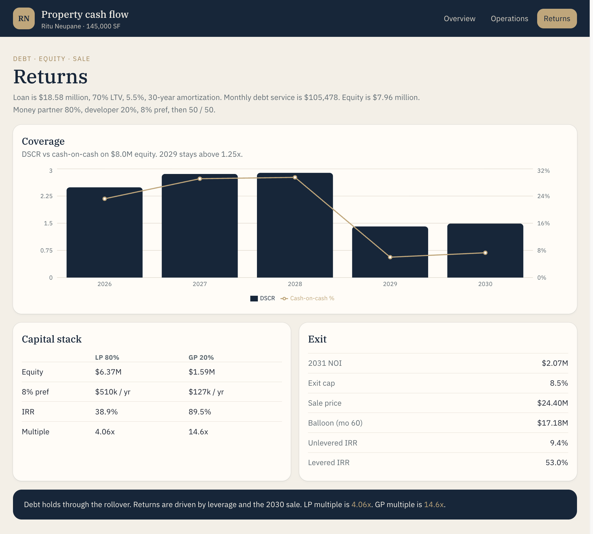

# Property cash flow

I built a five-year cash flow for a 145,000 SF multi-tenant property. Hold is January 2026 to December 2030. Sale uses 2031 NOI at an 8.5% cap.

**Ritu Neupane** · New York

This is my underwriting. Tenants are anonymized A–D.

## What I looked at

1. Does the hold still cover debt after Tenant A leaves?
2. Where does NOI actually come from?
3. What do LP and GP take home after the 8% pref?

## What I found

- Property value **$26.54 million** (NPV at 9.5%). Loan **$18.58 million** (70% LTV, 5.5%).
- Unlevered IRR **9.4%**. Levered IRR **53.0%**.
- 2028 NOI **$3.65 million** → 2029 NOI **$1.78 million**. Tenant A ends December 2028.
- Average DSCR **2.23x**. 2029 still above 1.25x.
- Exit **$24.40 million**. LP 4.06x / 38.9% IRR. GP 14.6x / 89.5% IRR.

## Dashboard

**Overview**



**Operations**



**Returns**



Open `docs/index.html` for the live board (Overview, Operations, Returns).

## Files

```
docs/                  live dashboard (Overview, Operations, Returns)
data/annual_summary.csv
data/assumptions.csv
data/tenant_rent_roll.csv
data/partnership_waterfall.csv
data/SOURCES.md
reports/property_memo.md
analysis/notes.md
screenshots/           overview, operations, returns
```

Open the CSVs in Excel if you want to check the math.
